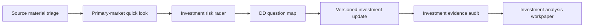

# AI Investment Workflow Skills

**Evidence-disciplined AI workflow skills for investor-style company research, business model understanding, diligence planning, versioned updates, and evidence review.**

[中文镜像 / Chinese mirror](README.zh-CN.md)

These workflow skills were originally designed from a primary-market technology investing context, but they are also useful for founders, analysts, strategy teams, product and business operators, and anyone who wants to understand a company through an investment research lens.

This is not a prompt collection. It is a small workflow package: each skill defines input boundaries, output structure, evidence discipline, prohibited wording, quality checks, sample inputs, sample outputs, and its relationship to an AI InvestOS-style investment workflow.

## What This Is Not

- Not an investment recommendation engine.
- Not legal, financial, tax, securities trading, or investment advice.
- Not a substitute for professional diligence, human judgment, investment committee review, or business decision-making.
- Not a claim that AI can automatically decide whether to invest.
- Not based on real project data. All examples are fictional and require human review.

## Who It Is For

**Core users**

- Primary-market investors and investment analysts.
- Venture capital, growth equity, CVC, strategic investment, and corporate strategy teams.
- FA / fundraising advisors and diligence teams.
- Technology, AI, robotics, AI infrastructure, and AI agent industry researchers.

**Extended users**

- Founders who want to understand how investors may read a company.
- Product, strategy, business operations, and commercial analysis teams.
- Readers who want to understand a company through project essence, business model, risk hypotheses, diligence questions, version changes, and evidence boundaries.

## 30-Second Overview

This repository helps turn company materials into structured investor-style research:

1. Triage held source materials, authority, currentness, conflicts, and evidence boundaries.
2. Form a quick-look judgment candidate through project essence, thesis, strong counter, falsification, and Value of Information.
3. Map investment logic into thesis-linked risks and fastest falsifiers.
4. Convert risks into diligence questions, material requests, and expected judgment impact.
5. Separate Material Delta, Evidence Delta, and Judgment Delta when new information arrives.
6. Audit claim support and overreach before an investment workpaper is circulated.

Commercial and business model understanding are core objects inside the investment research workflow. They are not positioned here as a generic business-analysis slogan.

## Recommended Starting Points

Recommended first run:

1. [`primary-market-quick-look`](skills/primary-market-quick-look/README.md)
   Reason: the best starting point for understanding how to analyze a company through an investment research lens.

2. [`investment-risk-radar`](skills/investment-risk-radar/README.md)
   Reason: converts highlights, assumptions, and evidence gaps into risk hypotheses and verification actions.

3. [`dd-question-map`](skills/dd-question-map/README.md)
   Reason: turns risk hypotheses into diligence questions, material requests, data checks, technical validation, customer references, and transaction review.

When new materials arrive:

- [`versioned-investment-update`](skills/versioned-investment-update/README.md)
  Reason: separates Material, Evidence, and Judgment Deltas instead of simply overwriting the prior report.

Before circulating a workpaper:

- [`investment-evidence-audit`](skills/investment-evidence-audit/README.md)
  Reason: checks evidence boundaries, overstatement risk, and required human review before circulation.

## Workflow



## Six Skills

| Skill | Role | Main Output |
| --- | --- | --- |
| [`source-material-triage`](skills/source-material-triage/README.md) | Bound what held materials can support | Source authority/currentness, conflicts, maturity, evidence boundary, missing evidence |
| [`primary-market-quick-look`](skills/primary-market-quick-look/README.md) | Form a first investment judgment candidate | Project essence, causal thesis, strong counter, falsifier, highest-value next evidence |
| [`investment-risk-radar`](skills/investment-risk-radar/README.md) | Map how the thesis may fail | Linked failure modes, fastest falsifiers, judgment sensitivity, DD priority |
| [`dd-question-map`](skills/dd-question-map/README.md) | Design decision-changing diligence | Research needs, verification targets, questions/requests, expected judgment impact |
| [`versioned-investment-update`](skills/versioned-investment-update/README.md) | Explain what truly changed after new information | Material Delta, Evidence Delta, Judgment Delta, candidate update |
| [`investment-evidence-audit`](skills/investment-evidence-audit/README.md) | Audit evidence boundary before circulation | Claim-support, authority/currentness, conflict, state-overreach, and rewrite findings |

## Quick Start / How to Use

These skills do not require a full system to try. A user can copy a skill's `skill.md`, `input_contract.md`, `output_schema.md`, and `quality_checklist.md` into an AI assistant together with desensitized company materials.

Recommended first run:

1. `primary-market-quick-look`
2. `investment-risk-radar`
3. `dd-question-map`

When new materials arrive:

- `versioned-investment-update`

Before circulating a workpaper:

- `investment-evidence-audit`

For a more technical workflow, users may keep skills and project materials in local directories and invoke a selected skill through Codex or a script-like wrapper.

Pseudo-command only; this repository does not include a built-in production CLI.

Example pattern:

```bash
run-skill primary-market-quick-look \
  --project ./projects/demo-company \
  --out ./outputs/demo-company/quick_look_v1.md
```

The command above is an illustrative CLI pattern, not a real command shipped by this repo.

## Using with Codex or Local File-Based Workflows

The skills define workflow contracts: what inputs are acceptable, how evidence should be labeled, what outputs should contain, and which claims require human review. Codex or similar AI coding agents can read local skill files and desensitized project materials, organize context, and generate Markdown workpapers.

Humans remain responsible for review, judgment, follow-up questions, and any business or investment decision. This repository does not include production orchestration code, model integrations, API connectors, or a built-in CLI.

## Shared Evidence Semantics

All six Skills use one lightweight public vocabulary for source, source type/date, `as_of`, qualitative authority/evidence strength, company claims, independent evidence, interview notes, financial snapshots, inference, Unknown/missing evidence, conflict, and Human Review.

See [Shared Evidence Semantics](EVIDENCE_SEMANTICS.md). The five invariants are:

1. Company claim is not verified fact.
2. Generated analysis is not source evidence.
3. A newer document is not automatically current truth.
4. Unknown remains explicit.
5. Human Review remains required for professional use.

## Research Modes

Research Mode describes the task's current information state. It is not a new Skill and this repository does not include a mode engine.

| Mode | Entry state | How to use the Skills |
| --- | --- | --- |
| **Greenfield** | Little or no usable internal material | Establish an initial public evidence base, then use the relevant Skills to form and test a bounded view |
| **Material-led** | BP, interviews, financial, operating, or other internal materials are available | Start from held materials; add external corroboration or contradiction only where it serves the decision question |
| **Deep DD** | A prior view and critical hypotheses or risks already exist | Use Risk Radar and DD Question Map to target the evidence most likely to change the judgment |
| **Incremental Update** | A historical judgment exists and new material or events arrive | Use Versioned Investment Update to separate Material, Evidence, and Judgment Deltas |

The user or surrounding workflow selects a mode based on the entry state and then composes the needed Skills. A decision objective—such as company research, DD verification, comparative/sector research, or transaction review—is a separate question from Research Mode. Transaction-driven work is therefore not a fifth mode.

## Professional Skills Inside a Governed Workflow

These Skills define professional research actions. In a broader system they may run inside a governed workflow that supplies context, tools, privacy controls, continuity, and Human Review. The generated output remains a candidate for professional review; it does not automatically become an accepted or current judgment.

This public repository does not implement routing, approval state, experience/Wiki systems, Skill evolution, evaluation infrastructure, recovery, or private transaction handling.

## Capabilities Under Real-World Validation

Two possible professional actions remain **Candidates**, not formal Skills:

- **External Research & Evidence Build:** testing whether `Research Need → Source Discovery → Source Authority → Independent Corroboration → Conflict → Evidence Build → Stop Condition` forms a stable contract across Greenfield and Material-led work.
- **Follow-on / Transaction Review:** testing whether `Historical Case → Evidence Delta → Company Judgment Delta → Transaction Terms → Company Judgment vs Transaction Judgment` produces independent value across more than one real project.

The repository still contains six formal Skills. No Candidate is promoted until its professional objective, input/process/output contract, cross-scenario repeatability, and value beyond composition of existing Skills have been validated and reviewed by humans.

## Public Boundary

- All examples use the fully fictional company **NovaCompute**.
- All numbers, customers, materials, revenue, financing, valuation, and transaction references in examples are fictional examples.
- Outputs must be reviewed by humans before use.
- These workflows are designed for research organization and evidence discipline; they do not produce investment, legal, financial, tax, or securities trading advice.

## End-to-End Example

See [`examples/nova_compute_end_to_end.md`](examples/nova_compute_end_to_end.md) for a fictional walkthrough across all six skills.

## Relationship to AI InvestOS

AI InvestOS is a broader workflow concept for organizing investment research, evidence discipline, risk mapping, diligence planning, versioned workpapers, and human review. This repository extracts a public, data-free workflow layer that can be reused independently.

## Repository Structure

```text
README.md
README.zh-CN.md
LICENSE
RELEASE_CHECKLIST.md
CONTRIBUTING.md
CHANGELOG.md
examples/
  nova_compute_end_to_end.md
  nova_compute_end_to_end.zh-CN.md
skills/
  source-material-triage/
  primary-market-quick-look/
  investment-risk-radar/
  dd-question-map/
  versioned-investment-update/
  investment-evidence-audit/
```

Each skill directory contains the English canonical files plus a `zh-CN/` mirror.

## How to Reference

Suggested neutral wording:

> AI Investment Workflow Skills is an open workflow package for evidence-disciplined, investor-style company research and primary-market diligence. It includes six reusable skills covering source triage, quick-look analysis, risk mapping, DD question design, versioned updates, and evidence review.

## License

See [`LICENSE`](LICENSE).
