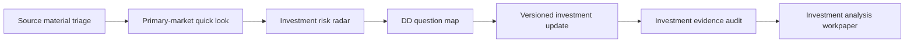

# AI Investment Workflow Skills

**Evidence-disciplined company research workflows, born from primary-market investing.**

[中文说明](README.zh-CN.md) · [Fictional end-to-end example](examples/nova_compute_end_to_end.md)

## 30-Second Overview

The hard part of company research is not just finding information. It is turning scattered materials into a clear view of what the company actually does, which problem it solves, why customers need it, how the business may work, what drives the thesis, where it may fail, and what remains a company claim or research hypothesis. AI can summarize every document; reading everything is not the same as understanding the company.

This repository separates that work into six reusable Skills: bound what held materials can support; identify the business essence and causal logic; form a structured judgment candidate; challenge it with evidence, a strong counter-thesis, and falsification; decide what to verify next; distinguish Material, Evidence, and Judgment Deltas; and audit overreach before circulation. Each Skill has an explicit input contract, output structure, evidence semantics, and quality checks. That is what makes this a workflow package rather than a prompt collection.

AI can help gather and challenge evidence, surface counter-arguments, prioritize diligence, preserve judgment history, and make work reviewable. Humans still define the problem, decide whether evidence is sufficient, handle exceptions, adopt or reject the judgment, and own any professional or investment decision.

The work originated in primary-market technology investing. The same evidence-disciplined actions can also support investment banking research, corporate strategy, company and industry research, transaction preparation, diligence teams, and founders preparing for investor diligence—without turning the repository into a generic business-analysis framework.

## Start with the Problem

| If your working problem is | Start with | What it gives you |
| --- | --- | --- |
| Materials are messy and you do not know what to trust | [`source-material-triage`](skills/source-material-triage/README.md) | Source authority/currentness, conflicts, evidence boundaries, and missing evidence |
| You have a BP and need to understand what the project is really betting on | [`primary-market-quick-look`](skills/primary-market-quick-look/README.md) | Project essence, thesis candidate, strong counter, falsification, and next verification |
| You have a preliminary view and want to know where it is most likely wrong | [`investment-risk-radar`](skills/investment-risk-radar/README.md) | Thesis-linked failure modes, fastest falsifiers, judgment sensitivity, and DD priority |
| An interview or diligence session is next and you need the highest-value questions | [`dd-question-map`](skills/dd-question-map/README.md) | Decision-changing questions, material requests, and expected judgment impact |
| New materials arrived and you need to know whether the judgment truly changed | [`versioned-investment-update`](skills/versioned-investment-update/README.md) | Material, Evidence, and Judgment Deltas plus a candidate update |
| A workpaper is about to circulate and inference may be written as fact | [`investment-evidence-audit`](skills/investment-evidence-audit/README.md) | Support, authority/currentness, conflict, state-overreach, and rewrite findings |

## First Run

No AI InvestOS runtime is required.

1. **Start from what you hold.** With only a BP, run Source Material Triage to mark company claims and boundaries, then run Quick Look. If sources are already bounded, start with the Skill matching your problem above.
2. **Give an AI assistant four files.** Use the selected Skill's `skill.md`, `input_contract.md`, `output_schema.md`, and `quality_checklist.md` together with appropriately redacted company materials.
3. **Keep the boundary visible.** Require the output to separate facts, company claims, inference, conflicts, and Unknowns, and to state the next verification step.
4. **Review as a professional.** The model may produce a judgment candidate; a human decides whether the evidence is sufficient and whether that candidate should be adopted.

## Workflow



## Shared Evidence Semantics

All six Skills use one lightweight public vocabulary for source, source type/date, `as_of`, qualitative authority/evidence strength, company claims, independent evidence, interview notes, financial snapshots, inference, Unknown/missing evidence, conflict, and Human Review.

See [Shared Evidence Semantics](EVIDENCE_SEMANTICS.md). The five invariants are:

1. Company claim is not verified fact.
2. Generated analysis is not source evidence.
3. A newer document is not automatically current truth.
4. Unknown remains explicit.
5. Human Review remains required for professional use.

## Research Modes

Research Mode describes the task's current information state. It is not a new Skill and this repository does not include a mode engine.

| Mode | Entry state | How to use the Skills |
| --- | --- | --- |
| **Greenfield** | Little or no usable internal material | Establish an initial public evidence base, then use the relevant Skills to form and test a bounded view |
| **Material-led** | BP, interviews, financial, operating, or other internal materials are available | Start from held materials; add external corroboration or contradiction only where it serves the decision question |
| **Deep DD** | A prior view and critical hypotheses or risks already exist | Use Risk Radar and DD Question Map to target the evidence most likely to change the judgment |
| **Incremental Update** | A historical judgment exists and new material or events arrive | Use Versioned Investment Update to separate Material, Evidence, and Judgment Deltas |

The user or surrounding workflow selects a mode based on the entry state and then composes the needed Skills. A decision objective—such as company research, DD verification, comparative/sector research, or transaction review—is a separate question from Research Mode. Transaction-driven work is therefore not a fifth mode.

## Professional Boundary

Each Skill provides a task definition, input contract, output structure, examples, and a quality checklist. The repository provides a research method, not a production runtime, automated approval system, or investment decision engine. Human Review decides whether evidence is sufficient, exceptions are reasonable, and a judgment candidate should be adopted.

## Capabilities Under Real-World Validation

Two possible professional actions remain **Candidates under real-world validation**, not formal Skills:

- **External Research & Evidence Build:** could extend Greenfield and public-research work from a research need through source discovery, corroboration, conflict handling, evidence build, and a stop condition.
- **Follow-on / Transaction Review:** could extend financing, transaction preparation, investment banking, and follow-on work by separating company judgment from transaction judgment.

The repository still contains six formal Skills. No Candidate is promoted until its professional objective, input/process/output contract, cross-scenario repeatability, and value beyond composition of existing Skills have been validated and reviewed by humans.

## Public Boundary

- All examples use the fully fictional company **NovaCompute**.
- All numbers, customers, materials, revenue, financing, valuation, and transaction references in examples are fictional examples.
- Outputs must be reviewed by humans before use.
- These workflows are designed for research organization and evidence discipline; they do not produce investment, legal, financial, tax, or securities trading advice.

## End-to-End Example

See [`examples/nova_compute_end_to_end.md`](examples/nova_compute_end_to_end.md) for a fictional walkthrough across all six skills.

## Relationship to AI InvestOS

AI InvestOS is a broader workflow concept for organizing investment research, evidence discipline, risk mapping, diligence planning, versioned workpapers, and human review. This repository extracts a public, data-free workflow layer that can be reused independently.

## Repository Structure

```text
README.md
README.zh-CN.md
LICENSE
RELEASE_CHECKLIST.md
CONTRIBUTING.md
CHANGELOG.md
EVIDENCE_SEMANTICS.md
examples/
  nova_compute_end_to_end.md
  nova_compute_end_to_end.zh-CN.md
skills/
  source-material-triage/
  primary-market-quick-look/
  investment-risk-radar/
  dd-question-map/
  versioned-investment-update/
  investment-evidence-audit/
```

Each skill directory contains the English canonical files plus a `zh-CN/` mirror.

## How to Reference

Suggested neutral wording:

> AI Investment Workflow Skills is an open workflow package for evidence-disciplined, investor-style company research and primary-market diligence. It includes six reusable skills covering source triage, quick-look analysis, risk mapping, DD question design, versioned updates, and evidence review.

## License

See [`LICENSE`](LICENSE).
