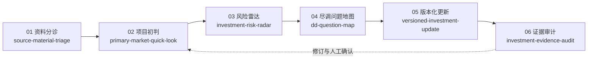

# AI Investment Workflow Skills

> Investor-style company research workflows for primary-market diligence, business model understanding, risk mapping, versioned updates, and evidence review.

## 一句话定位

一套以一级市场投资研究为主线的 AI workflow skills，用于系统理解一家公司的业务本质、商业模式、关键风险、尽调问题、版本变化与证据边界。

[查看 NovaCompute 端到端虚构案例](examples/nova_compute_end_to_end.md) · [查看发布检查表](RELEASE_CHECKLIST.md) · [参与贡献](CONTRIBUTING.md) · [查看变更记录](CHANGELOG.md)

## 适合谁使用

### 核心用户

- 一级市场投资人。
- 投资分析师。
- FA / 投融资顾问。
- 产业投资、战略投资和公司战略团队。
- 科技、AI、机器人、AI Infra 等方向的行业研究人员。

### 扩展用户

- 创业者 / founders。
- 产品、战略、商业分析从业者。
- 希望用投资研究框架快速理解一家公司的读者。
- 希望从公司本质、商业模式、风险假设和证据边界角度阅读项目资料的研究者。

这些 skills 是以投资研究为主线的公司研究 workflow，不是泛泛商业分析模板。商业模式理解是投资研究框架中的一个核心对象，而不是与投资研究并列的独立口号。

## 30 秒快速理解

这不是 prompt collection。六个 skills 共同组织：

- 项目资料：先判断材料是什么、能支持什么、还缺什么。
- 初步判断：解释公司本质、投资逻辑、亮点与反方假设。
- 风险和 DD：把逻辑断点转成风险、问题、材料请求和验证动作。
- 版本变化：新增资料后保留哪些判断被强化、削弱或仍待核验。
- 证据边界：区分公司口径、访谈、财务快照、推断和缺失证据。

每个 skill 都有输入边界、输出合同、证据标签、禁止性表述、虚构示例和人工复核要求。最终目标是形成更有判断深度、可审阅、可追溯的投资分析工作底稿。

## Workflow



## 六个 Skills 一览

| 顺序 | Skill | 核心问题 | 主要输出 |
| --- | --- | --- | --- |
| 01 | [source-material-triage](skills/source-material-triage/README.md) | 资料是什么，能支持什么？ | 材料清单、成熟度、冲突、缺口和判断边界 |
| 02 | [primary-market-quick-look](skills/primary-market-quick-look/README.md) | 这家公司本质上值得判断什么？ | 项目本质、投资逻辑、亮点、反方和下一步 |
| 03 | [investment-risk-radar](skills/investment-risk-radar/README.md) | 核心逻辑可能在哪里失效？ | 风险回链、证据状态、优先动作和材料请求 |
| 04 | [dd-question-map](skills/dd-question-map/README.md) | 应该问谁、查什么、什么会改变判断？ | 访谈、材料、数据、技术、客户和交易核验地图 |
| 05 | [versioned-investment-update](skills/versioned-investment-update/README.md) | 新资料到来后，判断发生了什么变化？ | V1/V2 强化、削弱、新增风险和母稿更新建议 |
| 06 | [investment-evidence-audit](skills/investment-evidence-audit/README.md) | 文本是否越过了证据边界？ | 逐条审计、改写建议、所需证据和人工复核项 |

## Quick Start / 如何使用

这组 skills 不必接入完整系统。可以把某个 skill 的 `skill.md`、`input_contract.md`、`output_schema.md` 和 `quality_checklist.md` 与脱敏项目材料一起交给 AI 助手使用。

推荐首次试用顺序：

1. `primary-market-quick-look`
2. `investment-risk-radar`
3. `dd-question-map`

新资料到来后：

- `versioned-investment-update`

正式流转前：

- `investment-evidence-audit`

如果需要更技术化的使用方式，也可以把 skills 和项目材料放入本地目录，作为 workflow contracts，通过 Codex 或命令行式 wrapper 调用指定 skill。

以下仅为伪命令 / 概念性 wrapper 示例；本仓库当前不内置生产级 CLI。

示例模式：

```bash
run-skill primary-market-quick-look \
  --project ./projects/demo-company \
  --out ./outputs/demo-company/quick_look_v1.md
```

上面的命令是 illustrative CLI pattern，不是本 repo 当前发布的真实命令。

## 配合 Codex 或本地文件型工作流使用

skills 负责定义工作流和边界：哪些输入可接受、证据如何标注、输出应包含什么、哪些判断必须人工复核。Codex 或类似 AI coding agent 可以读取本地 skill 文件和脱敏项目材料，组织上下文，并生成 Markdown 工作底稿。

人仍然负责判断、修正、继续追问和任何业务或投资决策。本仓库不包含生产级 orchestration 代码、模型接入、API connector 或内置 CLI。

## 推荐试用顺序

推荐首次试用：

1. [primary-market-quick-look](skills/primary-market-quick-look/README.md)：最适合新读者理解“如何用投资研究框架看一家公司”，覆盖项目本质、投资逻辑、亮点、反方假设、风险和下一步验证。
2. [investment-risk-radar](skills/investment-risk-radar/README.md)：体现投资研究中的反方思维和风险拆解，把亮点可能高估、逻辑断点和证据缺口转化为验证动作。
3. [dd-question-map](skills/dd-question-map/README.md)：把风险假设转为访谈、材料、数据、技术、客户和交易核验任务。

新资料到来后：

- [versioned-investment-update](skills/versioned-investment-update/README.md)：保留 V1/V2 判断变化，而不是简单重写一份报告。

正式流转前：

- [investment-evidence-audit](skills/investment-evidence-audit/README.md)：检查证据边界、过度确定性和人工复核要求。

随后可阅读 [NovaCompute 端到端案例](examples/nova_compute_end_to_end.md)，查看六个 skills 如何串联为完整 workflow。

## 统一 Evidence Labels

| 标签 | 含义 |
| --- | --- |
| `user_provided` | 用户直接提供的材料或说明 |
| `company_claim` | 公司、创始人或 BP 的单方口径 |
| `interview_note` | 访谈纪要中的陈述 |
| `financial_snapshot` | 财务快照、管理报表或模型摘录 |
| `third_party_unverified` | 第三方但尚未核验的材料 |
| `inferred` | 基于现有材料形成的分析推断 |
| `missing_evidence` | 会影响判断但尚未取得的证据 |
| `needs_human_review` | 必须由投资团队复核的内容 |

## 与 AI InvestOS 的关系

本仓库是 AI InvestOS 实践中可公开的方法层，不包含私有业务代码、模型配置、真实项目资料或项目状态决策。

AI InvestOS 将这些 skills 进一步组织为资料分诊、项目研判、风险雷达、核心待验证问题地图、版本管理、人工确认和 Markdown 工作底稿导出。公开仓库保留的是可独立复用的工作流合同，也适合作为后续系统接入的结构化方法基础。

## 公开边界

- 所有示例均为虚构或脱敏样例，不对应真实公司、客户、融资、收入、估值或交易。
- 这些 skills 帮助组织资料、判断、风险、DD 问题、版本变化和证据边界。
- 不构成投资建议、证券交易建议、法律、财务或税务意见。
- 不替代专业尽调、人工判断、投委会决策或公司经营决策。
- 不应默认把完整敏感项目资料发送给外部模型。
- 公司口径、访谈纪要和未核验第三方资料必须保留来源标签。
- 任何输出进入正式材料或经营讨论前，都需要适当的人工复核。

## 仓库结构

```text
.
├── README.md
├── LICENSE
├── CONTRIBUTING.md
├── CHANGELOG.md
├── RELEASE_CHECKLIST.md
├── examples/
│   └── nova_compute_end_to_end.md
└── skills/
    ├── source-material-triage/
    ├── primary-market-quick-look/
    ├── investment-risk-radar/
    ├── dd-question-map/
    ├── versioned-investment-update/
    └── investment-evidence-audit/
```

每个 skill 均提供 `skill.md`、输入合同、输出 schema、示例输入、示例输出和质量检查清单。

## 引用方式 / How to Reference

推荐使用以下中性引用：

> AI Investment Workflow Skills v0.1：一套以一级市场投资研究为主线，用于公司研究、尽调组织、风险映射、版本化更新与证据审计的开源 workflow skills。

引用时应同时说明：

1. 仓库示例全部为虚构数据。
2. skills 用于辅助研究与组织判断，不形成真实投资结论。
3. 核心价值在于工作流、证据纪律和人工复核，而非单次模型回答。

## License

[MIT License](LICENSE)
