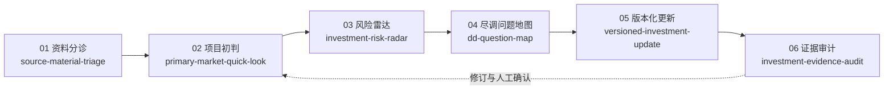

# AI Investment Workflow Skills

> Investor-style company research workflows for primary-market diligence, business model understanding, risk mapping, versioned updates, and evidence review.

## 一句话定位

一套以一级市场投资研究为主线的 AI workflow skills，用于系统理解一家公司的业务本质、商业模式、关键风险、尽调问题、版本变化与证据边界。

[查看 NovaCompute 端到端虚构案例](examples/nova_compute_end_to_end.zh-CN.md) · [查看发布检查表](RELEASE_CHECKLIST.md) · [参与贡献](CONTRIBUTING.md) · [查看变更记录](CHANGELOG.md)

## 适合谁使用

### 核心用户

- 一级市场投资人。
- 投资分析师。
- FA / 投融资顾问。
- 产业投资、战略投资和公司战略团队。
- 科技、AI、机器人、AI Infra 等方向的行业研究人员。

### 扩展用户

- 创业者 / founders。
- 产品、战略、商业分析从业者。
- 希望用投资研究框架快速理解一家公司的读者。
- 希望从公司本质、商业模式、风险假设和证据边界角度阅读项目资料的研究者。

这些 skills 是以投资研究为主线的公司研究 workflow，不是泛泛商业分析模板。商业模式理解是投资研究框架中的一个核心对象，而不是与投资研究并列的独立口号。

## 30 秒快速理解

这不是 prompt collection。六个 skills 共同组织：

- 项目资料：判断已有材料的来源、权威性、时效性、冲突、能支持什么和还缺什么。
- 初步判断：沿“项目本质 → 投资逻辑候选 → 最强反方 → 证伪 → 信息价值 → 下一步验证”形成候选判断。
- 风险和 DD：把逻辑断点转成最快证伪、判断敏感性、研究需要和会改变判断的验证动作。
- 版本变化：严格区分材料变化、证据变化和判断变化，不因收到新材料自动覆盖历史判断。
- 证据边界：检查来源支持、独立性、时效性、冲突、未知项和生成分析冒充证据。

每个 skill 都有输入边界、输出合同、证据标签、禁止性表述、虚构示例和人工复核要求。最终目标是形成更有判断深度、可审阅、可追溯的投资分析工作底稿。

## Workflow



## 六个 Skills 一览

| 顺序 | Skill | 核心问题 | 主要输出 |
| --- | --- | --- | --- |
| 01 | [source-material-triage](skills/source-material-triage/README.md) | 已有资料能支持什么？ | 来源权威性/时效性、冲突、成熟度、证据边界和缺失证据 |
| 02 | [primary-market-quick-look](skills/primary-market-quick-look/README.md) | 这个项目真正赌什么？ | 项目本质、因果逻辑、最强反方、证伪和最高价值证据 |
| 03 | [investment-risk-radar](skills/investment-risk-radar/README.md) | 当前逻辑最可能如何失效？ | 对应逻辑、最快证伪、判断敏感性和 DD 优先级 |
| 04 | [dd-question-map](skills/dd-question-map/README.md) | 什么答案会改变判断？ | 研究需要、信息价值、验证目标、问题/材料请求和判断影响 |
| 05 | [versioned-investment-update](skills/versioned-investment-update/README.md) | 新资料到来后，什么真的变了？ | Material Delta、Evidence Delta、Judgment Delta 和候选更新 |
| 06 | [investment-evidence-audit](skills/investment-evidence-audit/README.md) | 分析是否比证据更确定？ | 陈述—证据审计、时效/冲突/状态越界和改写建议 |

## Quick Start / 如何使用

这组 skills 不必接入完整系统。可以把某个 skill 的 `skill.md`、`input_contract.md`、`output_schema.md` 和 `quality_checklist.md` 与脱敏项目材料一起交给 AI 助手使用。

推荐首次试用顺序：

1. `primary-market-quick-look`
2. `investment-risk-radar`
3. `dd-question-map`

新资料到来后：

- `versioned-investment-update`

正式流转前：

- `investment-evidence-audit`

如果需要更技术化的使用方式，也可以把 skills 和项目材料放入本地目录，作为 workflow contracts，通过 Codex 或命令行式 wrapper 调用指定 skill。

以下仅为伪命令 / 概念性 wrapper 示例；本仓库当前不内置生产级 CLI。

示例模式：

```bash
run-skill primary-market-quick-look \
  --project ./projects/demo-company \
  --out ./outputs/demo-company/quick_look_v1.md
```

上面的命令是 illustrative CLI pattern，不是本 repo 当前发布的真实命令。

## 配合 Codex 或本地文件型工作流使用

skills 负责定义工作流和边界：哪些输入可接受、证据如何标注、输出应包含什么、哪些判断必须人工复核。Codex 或类似 AI coding agent 可以读取本地 skill 文件和脱敏项目材料，组织上下文，并生成 Markdown 工作底稿。

人仍然负责判断、修正、继续追问和任何业务或投资决策。本仓库不包含生产级 orchestration 代码、模型接入、API connector 或内置 CLI。

## 推荐试用顺序

推荐首次试用：

1. [primary-market-quick-look](skills/primary-market-quick-look/README.md)：最适合新读者理解“如何用投资研究框架看一家公司”，覆盖项目本质、投资逻辑、亮点、反方假设、风险和下一步验证。
2. [investment-risk-radar](skills/investment-risk-radar/README.md)：体现投资研究中的反方思维和风险拆解，把亮点可能高估、逻辑断点和证据缺口转化为验证动作。
3. [dd-question-map](skills/dd-question-map/README.md)：把风险假设转为访谈、材料、数据、技术、客户和交易核验任务。

新资料到来后：

- [versioned-investment-update](skills/versioned-investment-update/README.md)：保留 V1/V2 判断变化，而不是简单重写一份报告。

正式流转前：

- [investment-evidence-audit](skills/investment-evidence-audit/README.md)：检查证据边界、过度确定性和人工复核要求。

随后可阅读 [NovaCompute 端到端案例](examples/nova_compute_end_to_end.zh-CN.md)，查看六个 skills 如何串联为完整 workflow。

## 统一证据语义

六个 Skills 共同遵循根目录的 [Shared Evidence Semantics](EVIDENCE_SEMANTICS.md)，覆盖 `source`、`source_type`、`source_date`、`as_of`、定性 `authority / evidence_strength`、`company_claim`、`independent_evidence`、`interview_note`、`financial_snapshot`、`inferred`、`unknown / missing_evidence`、`conflict` 和 `needs_human_review`。

五条最小原则：

1. 公司口径不等于已核验事实。
2. 生成分析不等于来源证据。
3. 较新的文件不自动等于当前事实。
4. 未知项必须显式保留。
5. 专业使用前必须经过 Human Review。

## 四种 Research Mode

Research Mode 描述当前信息状态，不是四个新 Skills，本仓库也不实现 mode engine。

| Mode | 入口状态 | 使用方式 |
| --- | --- | --- |
| **Greenfield** | 基本没有可用内部材料 | 先建立第一版公开证据，再组合相关 Skills 形成有边界的初判 |
| **Material-led** | 已有 BP、访谈、财务或经营材料 | 以内生材料为主，只围绕判断问题做外部补证和反证 |
| **Deep DD** | 已有初判和关键假设/风险 | 用 Risk Radar 与 DD Question Map 定向验证最可能改变判断的证据 |
| **Incremental Update** | 已有历史判断，新材料或事件到来 | 用 Versioned Update 区分材料、证据和判断变化 |

系统或用户根据入口状态选择 Mode，再组合所需 Skills。Company Research、DD Verification、Comparative/Sector Research、Transaction Review 等属于 Decision Objective；Transaction-driven 不是第五种 Research Mode。

## 专业 Skills 与治理工作流

公开 Skills 定义专业研究动作；在更完整的系统中，它们可以运行于提供上下文、工具、隐私、连续性和 Human Review 的治理工作流中。生成结果仍是待专业复核的候选，不会自动成为当前或已接受判断。

本仓库不实现路由、审批状态、Experience/Wiki、Skill Evolution、Eval、恢复机制或私有交易处理。

## 正在真实验证的 Candidates

以下两项仍处于 **under real-world validation**，不是正式 Skills：

- **External Research & Evidence Build / 外部研究与证据构建**：验证“研究需要 → 来源发现 → 来源权威性 → 独立交叉验证 → 冲突 → 证据构建 → 停止条件”能否形成稳定专业合同。
- **Follow-on / Transaction Review / 后续轮与交易研判**：验证“历史投资逻辑 → 证据变化 → 公司判断变化 → 交易条款 → 公司判断与交易判断分离”能否跨项目稳定复现。

正式 Skill 数仍为 6。Candidate 只有在独立目标、稳定输入/流程/输出、跨场景复现、无法被现有 Skills 简单组合替代且经人工复核后，才可能晋升。

## 与 AI InvestOS 的关系

本仓库是 AI InvestOS 实践中可公开的方法层，不包含私有业务代码、模型配置、真实项目资料或项目状态决策。

AI InvestOS 将这些 skills 进一步组织为资料分诊、项目研判、风险雷达、核心待验证问题地图、版本管理、人工确认和 Markdown 工作底稿导出。公开仓库保留的是可独立复用的工作流合同，也适合作为后续系统接入的结构化方法基础。

## 公开边界

- 所有示例均为虚构或脱敏样例，不对应真实公司、客户、融资、收入、估值或交易。
- 这些 skills 帮助组织资料、判断、风险、DD 问题、版本变化和证据边界。
- 不构成投资建议、证券交易建议、法律、财务或税务意见。
- 不替代专业尽调、人工判断、投委会决策或公司经营决策。
- 不应默认把完整敏感项目资料发送给外部模型。
- 公司口径、访谈纪要和未核验第三方资料必须保留来源标签。
- 任何输出进入正式材料或经营讨论前，都需要适当的人工复核。

## 仓库结构

```text
.
├── README.md
├── LICENSE
├── CONTRIBUTING.md
├── CHANGELOG.md
├── RELEASE_CHECKLIST.md
├── examples/
│   ├── nova_compute_end_to_end.md
│   └── nova_compute_end_to_end.zh-CN.md
└── skills/
    ├── source-material-triage/
    ├── primary-market-quick-look/
    ├── investment-risk-radar/
    ├── dd-question-map/
    ├── versioned-investment-update/
    └── investment-evidence-audit/
```

每个 skill 均提供 `skill.md`、输入合同、输出 schema、示例输入、示例输出和质量检查清单。

## 引用方式 / How to Reference

推荐使用以下中性引用：

> AI Investment Workflow Skills v0.2：一套以一级市场投资研究为主线，用于公司研究、尽调组织、风险映射、版本化更新与证据审计的开源 workflow skills。

引用时应同时说明：

1. 仓库示例全部为虚构数据。
2. skills 用于辅助研究与组织判断，不形成真实投资结论。
3. 核心价值在于工作流、证据纪律和人工复核，而非单次模型回答。

## License

[MIT License](LICENSE)
